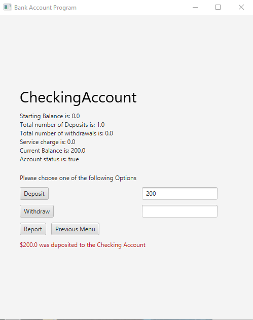

# Fake ATM Java Project

## Demo Link on youtube
youtu.be/EBuuzM3ywBE

## Description
This is my first java project using javaFX. It is a fake atm app where user can deposit and withdraw money from two different accounts and see detailed reports.

Developed in netbeans environment

## Main Menu

## Chequing Account and Details
